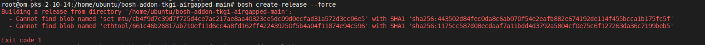

# BOSH ethtool addon

## What does this do?

Allows you to set ethtool properties such as Ring buffer values.  Defaults to bumping Rx/Tx to 400.
Allows to change the MTU size on the eth0 interface

## How do I install it?

1. Open a shell prompt on a BOSH CLI with access to your bosh director, such as Ops Manager.
2. Export your BOSH credentials to the enviornment.  These can be accessed via the Ops Manager GUI -> BOSH Director Tile -> Credentials Tab -> Bosh Commandline Credentials.

e.g.
```
export BOSH_CLIENT=ops_manager BOSH_CLIENT_SECRET=fakesecret BOSH_CA_CERT=/var/tempest/workspaces/default/root_ca_certificate  BOSH_ENVIRONMENT=10.0.0.10
```
3. Copy or clone this repository onto this BOSH CLI workstation and create+upload the BOSH release to the director

```
https://github.com/riazvm/bosh-addon-tkgi-airgapped.git
cd bosh-addon-tkgi-airgapped

```

4. Change the values of defaqult Tx and Rx in the spec file in the /jobs/ethtool folder
   Change the values of the MTU size in the spec file under /jobs/set_mtu

```

bosh create-release --force
bosh upload-release ./dev_releases/ethtool/ethtool-0+dev.1.yml

```


5. Configure the addon from this repo
```
bosh -n update-config --name=ethtool --type=runtime ./addon.yml
```
6. Update your BOSH VMs with a redeploy, e.g. bosh deploy CLI ; TAS for VMs via Ops Manager ; TKGI clusters via the TKGI CLI "upgrade/update-cluster" and/or Ops Manager "Apply Pending Changes" button with the TKGI upgrade errand enabled.  This addon will automatically be installed on all nodes with the default manifest `addon.yml`

## Update a new release of the addon?

7. To edit script and release a new version , update the script as per use case

8. Create a new version 


```
bosh create-release --force

```


Note the Release Version


9. Check release  under dev_releases folder


10. Update bosh release , note the release version in this case version 10, ethtoool-0+dev.2.yml

```
bosh upload-release ./dev_releases/ethtool/ethtool-0+dev.2.yml
```

11. Edit addon.yml to update the addon.yml to release version to the version that was created 0+dev.10

```
bosh -n update-config --name=tkgi-update-ringbuffer --type=runtime ./addon.yml
```

12. Update your TKGI clusters via the TKGI CLI and/or Ops Manager "Apply Pending Changes" button with the TKGI upgrade errand enabled. This addon will be automatically be deployed to the worker nodes

13. To verify ssh into the worker nodes and see if the script has been done.

## Troubleshooting

14. When creating a release if the following error occurs 

    

    Delete the .dev folder and try again